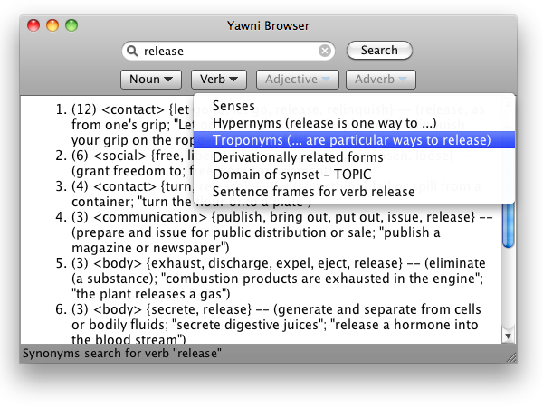

The Yawni Browser features:

* Clean look, simple user friendly controls, and snappy performance
* “Find as you type” (aka [incremental find](https://www.wikipedia.com/wiki/Incremental_find)) where the entered word (portion) appears anywhere in a matching word, or only as a prefix; search can also be restricted by part of speech Incremental find
* Comprehensive keyboard navigation, including Undo/Redo for typing and standard control-to-control navigation with the ⇥ (Tab) key
* Runs on OS X, macOS, Linux, and Windows; once installed, does not even require internet access!

 Try out the Yawni Browser!

