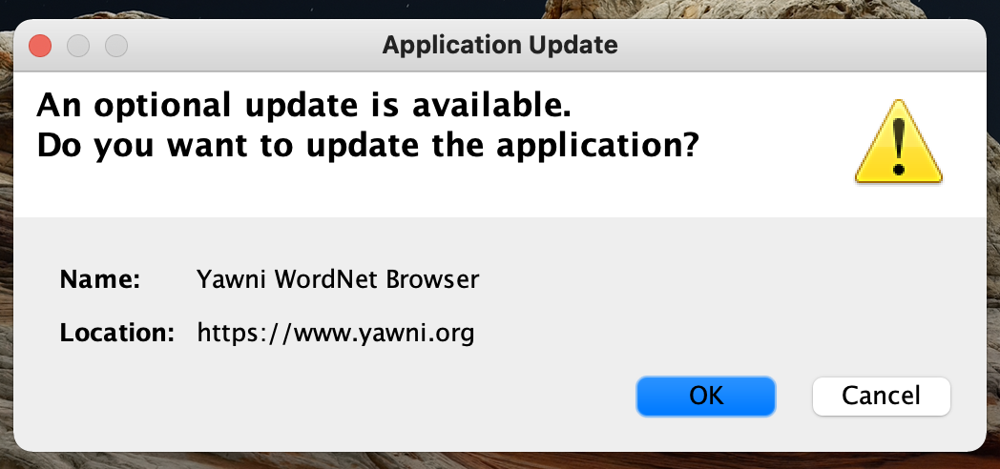

The [Yawni WordNet Browser](gui_wordnet_browser.html) runs on macOS 🍎, Linux 🐧, and Windows. One way to install it is just  clicking  in your desktop browser.

This way of using the Yawni WordNet Browser relies on Java Network Launch Protocol technology (<abbr title="Java Network Launch Protocol">[JNLP](https://docs.oracle.com/javase/tutorial/deployment/deploymentInDepth/jnlp.html)</abbr> 😃 for short), described as:

<blockquote class="blockquote">

The Java Network Launch Protocol (JNLP) enables an application to be launched on a client desktop by using resources that are hosted on a remote web server.

<footer class="blockquote-footer">
<cite title="The Java™ Tutorials: Java Network Launch Protocol"><a href="https://docs.oracle.com/javase/tutorial/deployment/deploymentInDepth/jnlp.html">The Java™ Tutorials: Java Network Launch Protocol</a></cite>
</footer>
</blockquote>

Installation on a desktop computer amounts to you trusting the author and clicking affirmatively several times...

1. #### 
Decide to “Keep“ <code>yawni.jnlp</code> 

1. #### 
Click the downloaded <code>yawni.jnlp</code> 
1. #### 
Cannot ⛔ be opened 🔒... click “OK†
1. #### 
Go to “Security & Privacy†in your System Preferences 
1. #### 
Click “Open Anyway†
1. #### 
macOS warning, but click the now-available “Open†button 
1. #### 
Tell Java it's OK to update the Yawni WordNet Browser application 
1. #### 
Yes, Run this application 
1. #### 
Great success! 🎉
1. #### 
Installs a shortcut on your desktop 🖥 too 
1. ### Explore the English 🏴󠁧󠁢󠁥󠁮󠁧󠁿 language 🚢 !!

